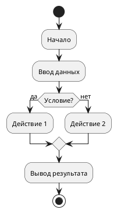
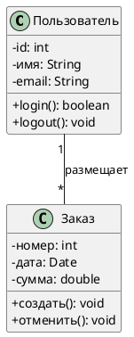
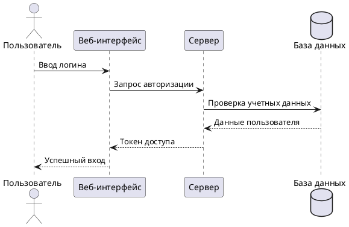
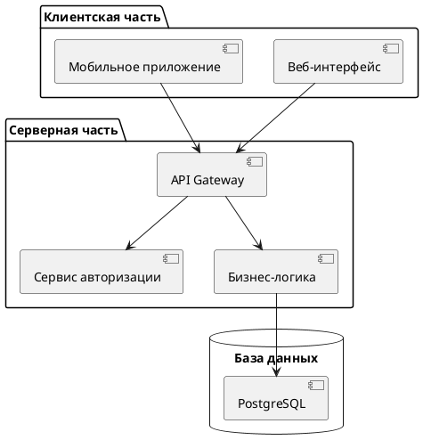
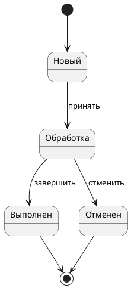
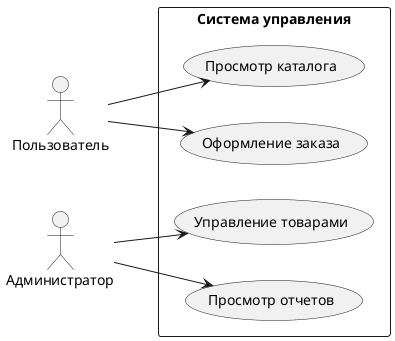
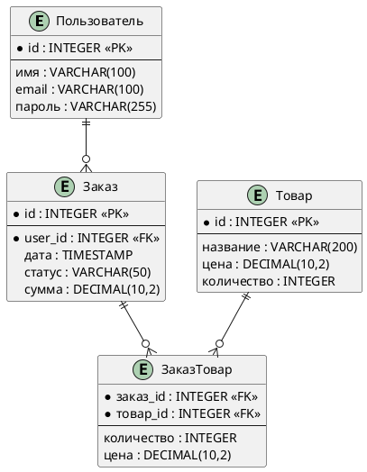
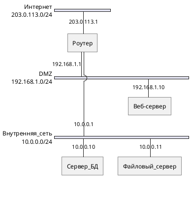
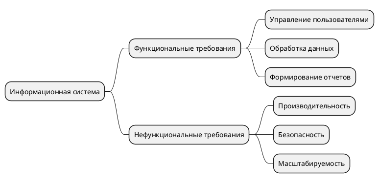

# GOST-UML: Automatic Diagram Generation for Russian Academic Papers

## Overview

This skill enhances the GOST-DOCX skill by automatically detecting when diagrams are needed and generating them using PlantUML. All diagrams are exported to PNG and inserted into GOST-compliant Word documents with proper Russian captions and numbering.

**Key principle**: Users describe what they need in Russian; Claude handles all technical implementation (PlantUML code, PNG export, DOCX insertion) behind the scenes.

## When to Use This Skill

Automatically trigger this skill when creating GOST documents that mention:

- **Algorithms**: блок-схема, алгоритм, схема алгоритма
- **System diagrams**: структурная схема, функциональная схема, архитектура системы
- **Database diagrams**: ER-диаграмма, схема базы данных, модель данных
- **UML diagrams**: диаграмма классов, диаграмма последовательности, диаграмма вариантов использования
- **Flowcharts**: блок-схема процесса, схема работы, технологическая схема
- **Network diagrams**: топология сети, схема сети
- **Any visual representation**: схема, диаграмма, граф, дерево

## Workflow

1. **Read GOST skill first**: `view /mnt/skills/user/gost-docx/SKILL.md`
2. **Detect diagram needs**: Analyze the document requirements
3. **Install PlantUML**: Set up local PlantUML environment
4. **Generate diagrams**: Create PlantUML code for each needed diagram
5. **Export to PNG**: Convert PlantUML to PNG images
6. **Insert into GOST document**: Add diagrams with proper GOST formatting

## PlantUML Setup

### Installation

```bash
# Install Java (required for PlantUML)
sudo apt-get update
sudo apt-get install -y default-jre

# Download PlantUML
cd /home/claude
wget https://github.com/plantuml/plantuml/releases/download/v1.2024.3/plantuml-1.2024.3.jar -O plantuml.jar

# Verify installation
java -jar plantuml.jar -version
```

### Generating PNG from PlantUML

```bash
# Create PlantUML file
cat > diagram.puml << 'EOF'
@startuml
...PlantUML code...
@enduml
EOF

# Generate PNG
java -jar /home/claude/plantuml.jar diagram.puml

# This creates diagram.png in the same directory
```

## Diagram Types and PlantUML Patterns

### 1. Flowcharts / Block Diagrams (Блок-схемы)



### 2. Class Diagrams (Диаграммы классов)



### 3. Sequence Diagrams (Диаграммы последовательности)



### 4. Component Diagrams (Компонентные диаграммы)



### 5. State Diagrams (Диаграммы состояний)



### 6. Use Case Diagrams (Диаграммы вариантов использования)



### 7. ER Diagrams (Диаграммы сущность-связь)



### 8. Network Diagrams (Сетевые диаграммы)



### 9. Gantt Charts (Диаграммы Ганта)

```plantuml
@startuml
skinparam defaultFontName Arial Unicode MS

[Анализ требований] lasts 10 days
[Проектирование] lasts 15 days
[Анализ требований] -> [Проектирование]
[Разработка] lasts 30 days
[Проектирование] -> [Разработка]
[Тестирование] lasts 10 days
[Разработка] -> [Тестирование]
@enduml
```

### 10. Mind Maps (Интеллект-карты)



## PlantUML Configuration for Russian Text

**CRITICAL**: Always include Russian font configuration at the start of every PlantUML file:

```plantuml
@startuml
skinparam defaultFontName Arial Unicode MS
skinparam defaultFontSize 11
' For specific diagram types, additional settings:
skinparam classAttributeIconSize 0  ' for class diagrams
skinparam sequenceMessageAlign center  ' for sequence diagrams
```

## GOST Integration: Inserting Diagrams

After generating PNG files from PlantUML, insert them into the GOST document using the docx-js library:

### Image Insertion Code

```javascript
const fs = require('fs');
const { Document, Paragraph, ImageRun, TextRun, AlignmentType } = require('docx');

// Read the generated PNG
const imageBuffer = fs.readFileSync('/home/claude/diagram.png');

// Insert image (centered, as per GOST)
new Paragraph({
  alignment: AlignmentType.CENTER,
  spacing: { before: 240, after: 120 }, // spacing around image
  children: [new ImageRun({
    type: "png",
    data: imageBuffer,
    transformation: {
      width: 450,  // adjust based on diagram complexity
      height: 300  // maintain aspect ratio
    },
    altText: {
      title: "Диаграмма",
      description: "Автоматически сгенерированная диаграмма",
      name: "diagram"
    }
  })]
}),

// Caption BELOW the image (GOST standard)
new Paragraph({
  spacing: { after: 240, line: 240 },  // single spacing for captions
  alignment: AlignmentType.CENTER,
  indent: { firstLine: 0 },  // no indent for captions
  children: [new TextRun({
    text: "Рисунок 1.1 — Структурная схема системы",
    font: "Times New Roman",
    size: 24,  // 12pt for captions
    bold: true
  })]
})
```

### Figure Numbering Rules

- **Section-based numbering**: Рисунок 1.1, Рисунок 1.2, Рисунок 2.1, etc.
- First number = section number
- Second number = figure number within section
- **Caption format**: `Рисунок X.Y — Название` (em-dash `\u2014` with spaces)
- **Caption style**: Centered, Times New Roman 12pt, bold
- **Caption placement**: Always BELOW the image

### Automatic Figure Numbering

Track figure numbers as you build the document:

```javascript
let currentSection = 1;
let figureInSection = 0;

function addFigure(imageBuffer, caption) {
  figureInSection++;
  const figureNumber = `${currentSection}.${figureInSection}`;
  
  return [
    // Image
    new Paragraph({
      alignment: AlignmentType.CENTER,
      spacing: { before: 240, after: 120 },
      children: [new ImageRun({
        type: "png",
        data: imageBuffer,
        transformation: { width: 450, height: 300 }
      })]
    }),
    // Caption
    new Paragraph({
      spacing: { after: 240, line: 240 },
      alignment: AlignmentType.CENTER,
      indent: { firstLine: 0 },
      children: [new TextRun({
        text: `Рисунок ${figureNumber} — ${caption}`,
        font: "Times New Roman",
        size: 24,
        bold: true
      })]
    })
  ];
}

// When starting a new section, reset figure counter
function startNewSection() {
  currentSection++;
  figureInSection = 0;
}
```

## Complete Workflow Example

### User Request
"Создай курсовую работу по базам данных с описанием структуры БД для интернет-магазина"

### Claude's Process (Behind the Scenes)

1. **Detect need**: Task mentions "структура БД" → need ER diagram
2. **Install PlantUML** (if not already installed)
3. **Generate PlantUML code**:

```bash
cat > /home/claude/er_diagram.puml << 'EOF'
@startuml
skinparam defaultFontName Arial Unicode MS

entity Пользователь {
  * id : INTEGER <<PK>>
  --
  имя : VARCHAR(100)
  email : VARCHAR(100)
  пароль : VARCHAR(255)
  телефон : VARCHAR(20)
}

entity Заказ {
  * id : INTEGER <<PK>>
  --
  * пользователь_id : INTEGER <<FK>>
  дата_создания : TIMESTAMP
  статус : VARCHAR(50)
  общая_сумма : DECIMAL(10,2)
}

entity Товар {
  * id : INTEGER <<PK>>
  --
  название : VARCHAR(200)
  описание : TEXT
  цена : DECIMAL(10,2)
  количество : INTEGER
  категория_id : INTEGER <<FK>>
}

entity Категория {
  * id : INTEGER <<PK>>
  --
  название : VARCHAR(100)
  описание : TEXT
}

entity ЗаказТовар {
  * заказ_id : INTEGER <<FK>>
  * товар_id : INTEGER <<FK>>
  --
  количество : INTEGER
  цена_за_единицу : DECIMAL(10,2)
}

Пользователь ||--o{ Заказ
Заказ ||--o{ ЗаказТовар
Товар ||--o{ ЗаказТовар
Категория ||--o{ Товар
@enduml
EOF
```

4. **Export to PNG**:

```bash
java -jar /home/claude/plantuml.jar /home/claude/er_diagram.puml
```

5. **Create GOST document** with diagram inserted in appropriate section
6. **User sees**: Complete GOST document with professionally formatted ER diagram

## Common Diagram Scenarios in Russian Academic Papers

### Курсовая работа по программированию
- Class diagrams for OOP design
- Sequence diagrams for program flow
- Flowcharts for algorithms

### ВКР по информационным системам
- ER diagrams for database design
- Component diagrams for system architecture
- Use case diagrams for requirements

### Дипломная работа по сетям
- Network topology diagrams
- Sequence diagrams for protocols
- State diagrams for network devices

### Курсовой проект по алгоритмам
- Flowcharts for algorithm steps
- Activity diagrams for process flow
- State diagrams for automata

## Error Handling

### PlantUML Not Installed

```bash
if ! command -v java &> /dev/null; then
  echo "Installing Java..."
  sudo apt-get update && sudo apt-get install -y default-jre
fi

if [ ! -f /home/claude/plantuml.jar ]; then
  echo "Downloading PlantUML..."
  wget https://github.com/plantuml/plantuml/releases/download/v1.2024.3/plantuml-1.2024.3.jar -O /home/claude/plantuml.jar
fi
```

### PlantUML Syntax Errors

```bash
# Validate PlantUML syntax before generating PNG
java -jar /home/claude/plantuml.jar -syntax diagram.puml

# If errors exist, fix them before proceeding
```

### Font Issues with Russian Text

If Russian characters don't render properly:

```plantuml
@startuml
' Try different fonts
skinparam defaultFontName DejaVu Sans
' or
skinparam defaultFontName Liberation Sans
@enduml
```

## Best Practices

1. **Always read GOST skill first**: Use `view /mnt/skills/user/gost-docx/SKILL.md` before starting
2. **Use Russian labels**: All diagram text in Russian except technical terms (id, email, etc.)
3. **Keep diagrams simple**: Max 8-10 entities/components per diagram
4. **Consistent naming**: Use Russian naming conventions (camelCase for variables, PascalCase for classes)
5. **Proper sizing**: Images should be readable but not oversized (450-600px width typical)
6. **Section placement**: Place diagrams in appropriate sections (usually after explaining the concept in text)
7. **Reference in text**: Always reference figures in text: "На рисунке 2.1 представлена структура базы данных..."

## Quality Checklist

Before finalizing the document:

- [ ] PlantUML installed and working
- [ ] All diagrams use Russian font configuration
- [ ] All diagrams exported to PNG successfully
- [ ] Figure numbers are sequential within sections
- [ ] Captions use em-dash (—) with spaces
- [ ] Captions are centered, 12pt, bold
- [ ] Images are centered
- [ ] All figures referenced in text
- [ ] Diagrams readable at current size
- [ ] GOST margins preserved (30/10/20/20 mm)

## Dependencies

- **Java Runtime**: Required for PlantUML
- **PlantUML JAR**: v1.2024.3 or later
- **GOST-DOCX skill**: Read before using this skill
- **docx-js**: For creating Word documents
- **bash**: For automation scripts

---

## Summary

This skill seamlessly integrates PlantUML diagram generation into GOST-compliant academic documents. Users describe their needs in Russian, and Claude handles all technical details: PlantUML code generation, PNG export, proper GOST formatting, and document assembly. The result is professional academic papers with high-quality technical diagrams that meet Russian academic standards.
